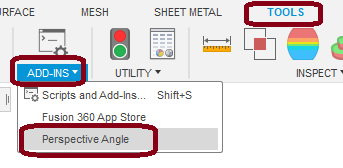
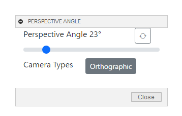

# Fusion360 Perspective Angle Controller

This is an add-in for the Autodesk software Fusion360.

It displays a modaless dialog to adjust the Perspective Angle of the screen.
Since this add-in is a modaless dialog, you can work while it is displayed.

---

## Installation :

To install, download/extract the zip file and register the "PerspectiveAngleController" folder as an add-in.

Please follow the instructions [here](https://knowledge.autodesk.com/support/fusion-360/troubleshooting/caas/sfdcarticles/sfdcarticles/How-to-install-an-ADD-IN-and-Script-in-Fusion-360.html).

## Usage :

- Launch the add-in. The "Perspective Angle" command will be added to the "Tools" tab, in the "Add-ins" panel.

  

- Execute the command.

- A dialog box will appear. Adjust each item.

  

  - Perspective Angle

    - Use the slider to adjust. The adjustable range is 1° to 149°.

  - Camera Types

    - Each click toggles between "Orthographic" and "Perspective".

      ※Basically, orthographic projection is meaningless.

  - About the "Force Apply" button
    Currently, we know that the following will reset the perspective angle to 23°.

    - Press Home in the view cube.
    - Change the workspace (e.g. Design -> Render).

      Even if it is reset, pressing the button will change the perspective angle by the value in the dialog.

## Action :

Confirmed in the following environment.

- Fusion360 Ver2.0.11415
- Windows10 64bit Pro , Home

## License :

MIT

## Acknowledgments :

Thank you, [JeromeBriot](https://forums.autodesk.com/t5/user/viewprofilepage/user-id/3865419) , [thomasa88](https://forums.autodesk.com/t5/user/viewprofilepage/user-id/7468050)

---

---

これは、オートデスクソフトウェア「Fusion360」のアドインです。

画面の視点角度を調整するためのモーダレスダイアログを表示します。
本アドインはモーダレスダイアログの為、表示したまま作業が可能です。

---

## インストール :

インストールする際は、zip ファイルをダウンロード/展開後 "PerspectiveAngleController" フォルダをアドインとして登録してください。

アドインの登録は、[こちら](https://kantoku.hatenablog.com/entry/2021/02/15/161734)の手順に従ってください。

## 使用法 :

- アドインを起動。"ツール" タブの "アドイン" パネル内に "視点角度を調整" コマンドが追加されます。

  

- コマンドを実行。

- ダイアログが表示されます。各項目を調整してください。

  

  - 視点角度

    - スライダーで調整してください。調整可能範囲は 1° ～ 149° です。

  - カメラタイプ

    - クリックする度に "正投影" と "パース" が切り替わります。

      ※基本的に正投影では無意味です。

  - "強制適用" ボタンについて
    現在、次の操作を行うと視点角度が 23° にリセットされることが分かっています。

    - ビューキューブの Home を押す。
    - ワークスペースを変更する。(例：デザイン -> レンダリング)

      リセットされても、ボタンを押す事でダイアログの数値で視点角度を変更します。

## アクション :

以下の環境で確認しています。

- Fusion360 Ver2.0.11415
- Windows10 64bit Pro , Home

## ライセンス :

MIT

## 謝辞 :

- [日本語フォーラム](https://forums.autodesk.com/t5/fusion-360-ri-ben-yu/bd-p/707)の皆さん、ありがとう。
