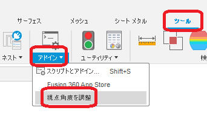
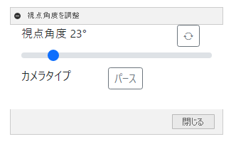

# Fusion360 Perspective Angle Controller

これは、オートデスクソフトウェア「Fusion360」のアドインです。

画面の視点角度を調整するためのモーダレスダイアログを表示します。
本アドインはモーダレスダイアログの為、表示したまま作業が可能です。

---

## インストール :

インストールする際は、zip ファイルをダウンロード/展開後 "PerspectiveAngleController" フォルダをアドインとして登録してください。

アドインの登録は、[こちら](https://kantoku.hatenablog.com/entry/2021/02/15/161734)の手順に従ってください。

## 使用法 :

- アドインを起動。"ツール" タブの "アドイン" パネル内に "視点角度を調整" コマンドが追加されます。

  

- コマンドを実行。

- ダイアログが表示されます。各項目を調整してください。

  

  - 視点角度

    - スライダーで調整してください。調整可能範囲は 1° ～ 149° です。

  - カメラタイプ

    - クリックする度に "正投影" と "パース" が切り替わります。

      ※基本的に正投影では無意味です。

  - "強制投影" ボタンについて
    現在、次の操作を行うと視点角度が 23° にリセットされることが分かっています。

    - ビューキューブの Home を押す。
    - ワークスペースを変更する。(例：デザイン -> レンダリング)

      リセットされても、ボタンを押す事でダイアログの数値で視点角度を変更します。

## アクション :

以下の環境で確認しています。

- Fusion360 Ver2.0.11415
- Windows10 64bit Pro , Home

## ライセンス :

MIT

## 謝辞 :

- [日本語フォーラム](https://forums.autodesk.com/t5/fusion-360-ri-ben-yu/bd-p/707)の皆さん、ありがとう。
